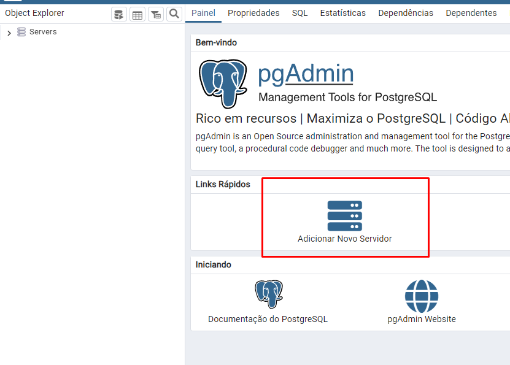
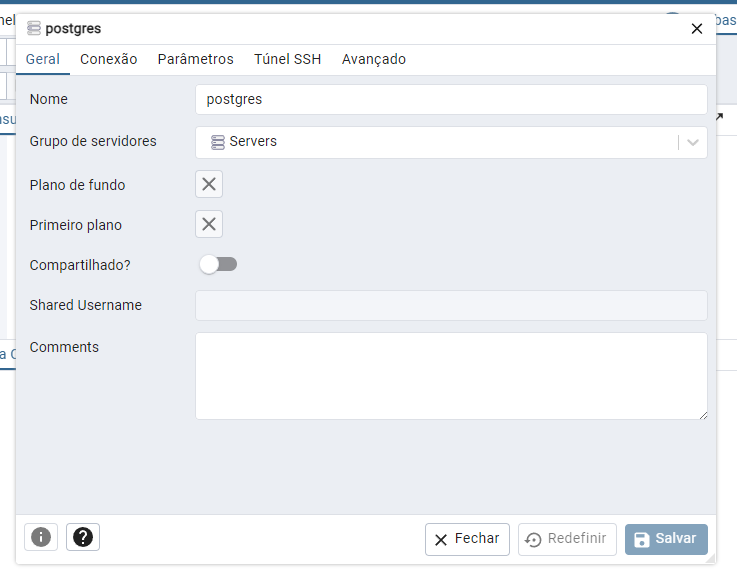
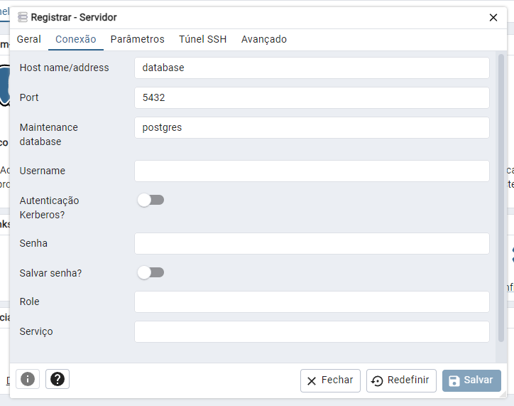

  
 ## OnTask - Backend
  

## 📁 Informações do projeto:

- O projeto se trata do backend da aplicação "OnTask", meu projeto de TCC da UniFagoc no ano de 2024. O projeto é um protótipo de uma ferramenta open source voltada para a gestão de projetos e tarefas. A solução proposta busca não apenas facilitar o mapeamento e controle das atividades, mas também fornecer dados relevantes para melhorar a estimativa de tempo em projetos futuros. A flexibilidade do sistema permitirá que empresas personalizem suas funcionalidades conforme suas necessidades específicas, garantindo sua adequação às demandas do mercado. Assim, o protótipo visa demonstrar sua viabilidade como uma ferramenta eficaz na promoção de uma gestão mais organizada e eficiente. 
  

## ✔️ Requisitos:
- Possuir o Docker Desktop instalado e devidamente configurado
- Possuir alguma Application Programming Interfaces, preferencialmente o POSTMAN devido as collections que acompanham os arquivos do projeto
- Recomandado o uso da IDE VSCode

## ▶️ Utilização do projeto:

- Para utilização do projeto  após clonar o prijeto deve-se seguir os seguintes passos:

1. Abra a IDE e preenche o arquivo *.env*` conforme o *.env-example* com as credenciais que deseja utilizar;

2. `docker-compose up -d ` para inicializar e subir o container;

Com isso a aplicação já estará em execução e pronta para ser utilizada.

## 💾 Visualização dos dados:
Caso queira, foi adicionado ao serviços do container o pgAdmin para facilitar a visualização dos dados. Segue o passo a passo para utilização:

1. Acesse o pgAdmin (SBD escolhido) no proprio navegador pelo link: `http://localhost:8081/browser/`;

2. Ao acessar, deverá informar as credenciais de acesso ao painel administrativo conforme as preencheu no arquivo *.env*;

    

3. Ao acessar, deve clicar em *ADICIONAR NOVO SERVIDOR*. A seguir os passos:

    

4. Aba Geral - Nome: `postgres`;

    

5. Aba Conexão - Informe os campos: Host, Port, Username, Password de acordo com o *.env*;

    

Ao clicar em salvar, se todos os dados estiverem corretos você conseguirá conectar com sucesso.

## ⚙️ Tecnologias utilizadas

- `NodeJS`
- `Typescript`
- `Postgres`
- `Docker`
- `Express`
- `Swagger`

## ⚙️ Modelo Entidade Relacionamento(DER):

  
ModelagemDoBanco.png.png)

 

## 🧭 Contrato de rotas da API:

  

